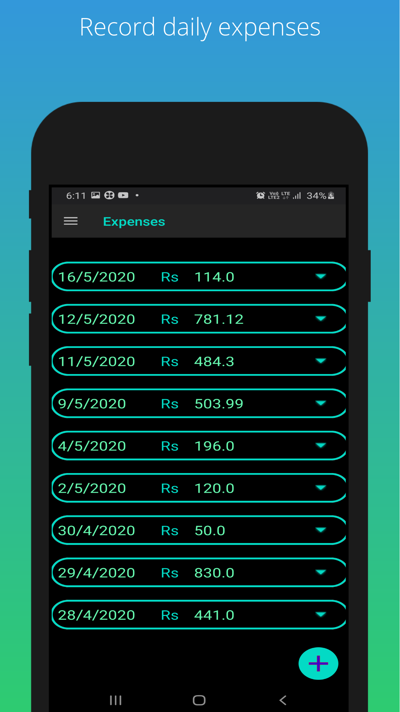
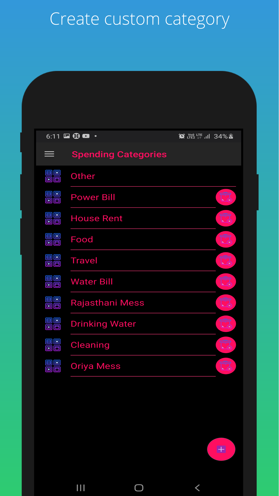
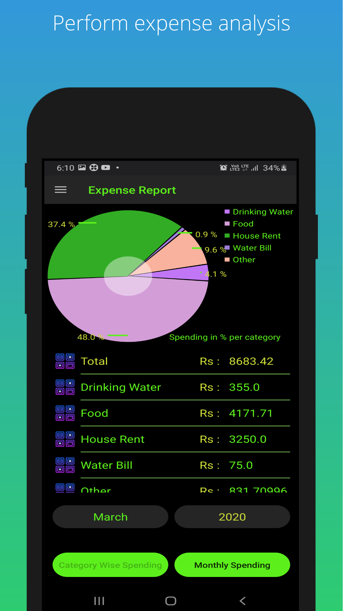
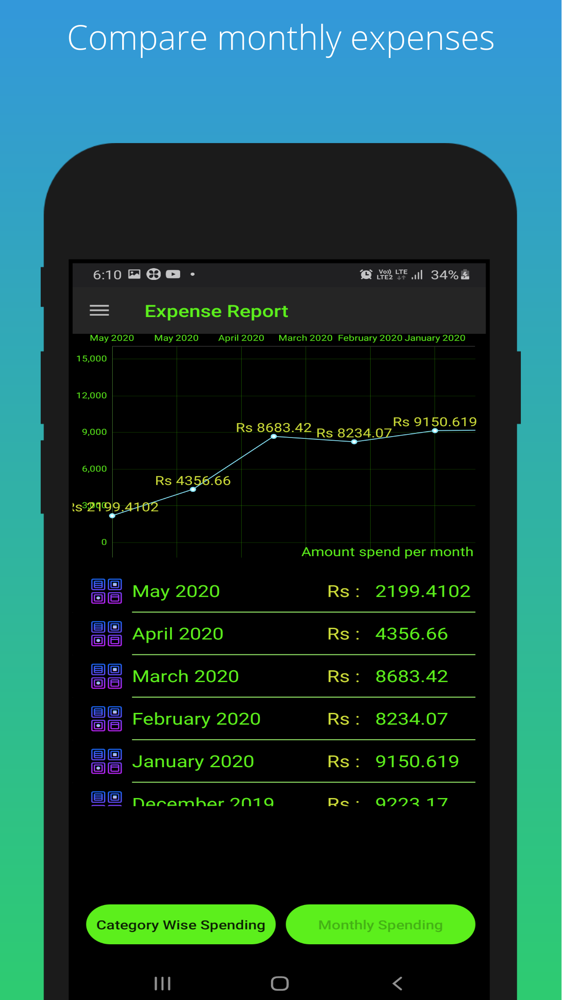
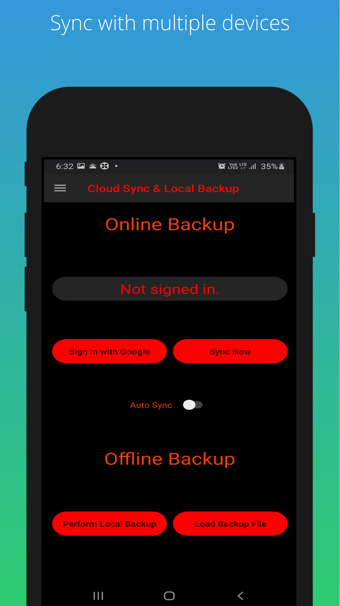
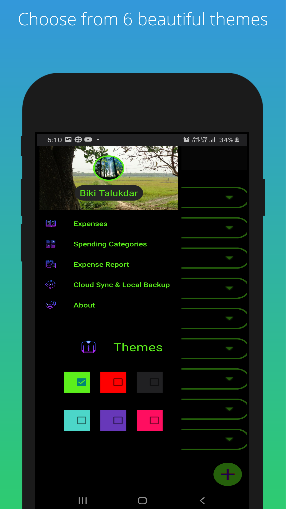

# ExpenseMonitor2

Expense Monitor is an open source and free as in freedom app to record your daily expenses. 

Key Features:-
1. Records your daily expenses. 
2. It has syncing feature which allows you to sync you expenses across devices.
3. It helps you perform detailed analysis you your monthly expenses. 
4. There are 6 different themes for the app to choose from.
5. It is free as in freedom and licensed under GPLv3.

Icons used inside the app (excluding the main app icon) are from Icon8.
Icon8- https://icons8.com

